# 💰 DhanSetu - Personal Finance Intelligence Platform

## 🎯 Problem Statement

India's informal workforce—gig workers, small business owners, and individuals without formal credit histories—faces significant financial challenges:
- **Irregular Income**: Cash flow varies dramatically month to month
- **Poor Spending Discipline**: Overspending during high-income months, struggling during lean periods
- **Limited Credit Access**: No formal credit history means no traditional loans
- **Lack of Financial Guidance**: No structured savings or spending insights

**The Opportunity**: Their SMS and digital transaction data contains valuable patterns that remain untapped.

---

## 💡 Our Solution: DhanSetu

**DhanSetu** (Bridge to Wealth) is a personal finance intelligence platform that transforms raw SMS transaction data into actionable financial wisdom, helping users achieve financial stability through smart spending, disciplined savings, and credit-building opportunities.

### 🌟 Key Features

#### 1. **Smart Cash Flow Management**
- AI-powered income pattern detection for irregular earners
- Dynamic "Safe Spend" calculator based on upcoming bills and income predictions
- Real-time cash flow alerts: *"You have ₹2,500 safe to spend this week"*

#### 2. **Impulse Control & Opportunity Cost Nudges**
- Detects wasteful spending patterns (frequent food delivery, unnecessary subscriptions)
- Shows opportunity cost: *"If you had invested ₹500 in gold instead of that purchase, you'd have ₹1,200 today"*
- Behavioral nudges before payday to prevent overspending

#### 3. **Bharat Credit Score**
- Alternative credit scoring for the unbanked/underbanked
- Built from SMS transaction history, payment regularity, and savings discipline
- Opens doors to microloans and financial inclusion

#### 4. **Goal-Based Savings**
- Set financial goals (emergency fund, business expansion, festival expenses)
- Auto-suggest savings amounts based on income patterns
- Gamified milestones with rewards and badges

#### 5. **Financial Health Dashboard**
- Visual spending breakdown by category
- Income vs. Expense trends
- Personalized financial health score (0-100)
- Monthly financial report cards

#### 6. **Bill Prediction & Reminders**
- ML-based recurring bill detection (rent, EMIs, subscriptions)
- Proactive reminders: *"Rent of ₹5,000 due in 3 days. Current balance: ₹4,200"*

---

## 🏗️ System Architecture

```mermaid
graph TB
    subgraph "User Layer"
        User([👤 User])
        UI[📱 Mobile/Web Interface]
    end
    
    subgraph "Data Collection Layer"
        SMS[📨 SMS Permission]
        UPI[💳 UPI Transaction Data]
        Manual[✍️ Manual Entry]
    end
    
    subgraph "Processing Layer"
        Parser[🔍 SMS Parser]
        Categorizer[🏷️ Transaction Categorizer]
        MLEngine[🤖 ML Analysis Engine]
    end
    
    subgraph "Intelligence Layer"
        IncomeAnalysis[📊 Income Pattern Detection]
        ExpenseAnalysis[💸 Expense & Impulse Tracker]
        BillPredictor[📅 Recurring Bill Predictor]
        SafeSpend[💰 Safe Spend Calculator]
        CreditScore[⭐ Credit Score Generator]
        Nudges[💡 Smart Nudge Engine]
    end
    
    subgraph "Action Layer"
        Dashboard[📊 Financial Dashboard]
        Alerts[🔔 Real-time Alerts]
        Goals[🎯 Goal Tracker]
        Reports[📈 Insights & Reports]
    end
    
    User -->|Grants Permission| SMS
    User -->|Connects| UPI
    User -->|Adds Data| Manual
    
    SMS --> Parser
    UPI --> Parser
    Manual --> Parser
    
    Parser --> Categorizer
    Categorizer --> MLEngine
    
    MLEngine --> IncomeAnalysis
    MLEngine --> ExpenseAnalysis
    MLEngine --> BillPredictor
    
    IncomeAnalysis --> SafeSpend
    BillPredictor --> SafeSpend
    ExpenseAnalysis --> Nudges
    IncomeAnalysis --> CreditScore
    ExpenseAnalysis --> CreditScore
    
    SafeSpend --> Dashboard
    SafeSpend --> Alerts
    Nudges --> Alerts
    CreditScore --> Dashboard
    IncomeAnalysis --> Reports
    ExpenseAnalysis --> Reports
    
    Dashboard --> UI
    Alerts --> UI
    Goals --> UI
    Reports --> UI
    UI --> User
    
    style User fill:#e1f5ff,stroke:#0288d1,stroke-width:3px
    style MLEngine fill:#fff3e0,stroke:#f57c00,stroke-width:2px
    style SafeSpend fill:#c8e6c9,stroke:#388e3c,stroke-width:2px
    style CreditScore fill:#f8bbd0,stroke:#c2185b,stroke-width:2px
    style Dashboard fill:#d1c4e9,stroke:#512da8,stroke-width:2px
```

---

## 🔄 User Flow

```mermaid
flowchart TD
    Start([🚀 User Opens App]) --> Onboard{First Time?}
    
    Onboard -->|Yes| Welcome[👋 Welcome Screen]
    Welcome --> Permissions[📱 Request SMS Permission]
    Permissions --> Scan[🔍 Scan Last 6 Months SMS]
    Scan --> Processing[⚙️ Processing Transactions...]
    Processing --> Profile[✨ Generate Initial Profile]
    
    Onboard -->|No| Home[🏠 Home Dashboard]
    Profile --> Home
    
    Home --> Display1[💰 Current Balance: ₹12,340]
    Home --> Display2[✅ Safe to Spend Today: ₹850]
    Home --> Display3[⭐ Financial Health Score: 72/100]
    Home --> Display4[🎯 Goals Progress]
    
    Home --> Action{User Action}
    
    Action -->|View Transactions| Transactions[📋 Transaction History]
    Transactions --> Filter[🔍 Filter by Category/Date]
    Filter --> Details[💳 Transaction Details]
    
    Action -->|Check Insights| Insights[📊 Spending Insights]
    Insights --> Patterns[📈 Pattern Analysis]
    Patterns --> Suggestions[💡 Personalized Suggestions]
    
    Action -->|Set Goals| Goals[🎯 Financial Goals]
    Goals --> NewGoal[➕ Create New Goal]
    NewGoal --> TrackGoal[📊 Track Progress]
    
    Action -->|View Score| Score[⭐ Bharat Credit Score]
    Score --> ScoreBreakdown[📋 Score Factors]
    ScoreBreakdown --> Improve[💪 How to Improve]
    
    Action -->|Receive Nudge| Nudge[🔔 Smart Nudge]
    Nudge --> NudgeType{Nudge Type}
    
    NudgeType -->|Warning| Warn[⚠️ High Spending Alert]
    NudgeType -->|Opportunity| Opp[💎 Investment Opportunity]
    NudgeType -->|Bill Reminder| Bill[📅 Upcoming Bill: ₹5,000]
    
    Warn --> Decision{User Response}
    Opp --> Decision
    Bill --> Decision
    
    Decision -->|Acknowledge| Home
    Decision -->|Take Action| ActionTaken[✅ Action Recorded]
    ActionTaken --> UpdateScore[📈 Update Financial Score]
    UpdateScore --> Home
    
    style Start fill:#4caf50,stroke:#2e7d32,stroke-width:3px,color:#fff
    style Home fill:#2196f3,stroke:#1565c0,stroke-width:2px,color:#fff
    style Nudge fill:#ff9800,stroke:#e65100,stroke-width:2px
    style Score fill:#9c27b0,stroke:#6a1b9a,stroke-width:2px,color:#fff
    style UpdateScore fill:#4caf50,stroke:#2e7d32,stroke-width:2px
```

---

## 🎮 Gamification Elements

### Financial Health Score (0-100)
- **0-40**: 🔴 Needs Attention
- **41-60**: 🟡 Fair
- **61-80**: 🟢 Good
- **81-100**: 🏆 Excellent

### Achievement Badges
- 🎖️ **First Goal Achieved**
- 💎 **Saver of the Month**
- 🛡️ **Emergency Fund Complete**
- 🔥 **30-Day No Impulse Streak**
- 👑 **Credit Score Elite (90+)**

### Leaderboard (Optional)
- Anonymous comparison with similar income groups
- Motivational challenges (e.g., "Save ₹500 this week")

---

## 🛠️ Technology Stack

### Frontend
- **Mobile**: React Native / Flutter
- **Web**: React.js with TailwindCSS
- **Charts**: Recharts / Chart.js

### Backend
- **API**: Node.js (Express) / Python (FastAPI)
- **Database**: PostgreSQL (structured data) + MongoDB (transaction logs)
- **Caching**: Redis

### AI/ML Components
- **SMS Parsing**: Regex + NLP (spaCy)
- **Transaction Categorization**: scikit-learn (Random Forest)
- **Pattern Detection**: Time series analysis (ARIMA/Prophet)
- **Anomaly Detection**: Isolation Forest
- **Credit Scoring**: Custom ML model (XGBoost)

### Infrastructure
- **Hosting**: AWS / Google Cloud
- **Storage**: S3 (encrypted transaction data)
- **Security**: End-to-end encryption, OAuth 2.0

---

## 📊 Data Flow Pipeline

```mermaid
flowchart LR
    subgraph Input
        A1[📱 SMS Data]
        A2[💳 UPI APIs]
        A3[✍️ Manual Entry]
    end
    
    subgraph Extract
        B[🔍 Data Extraction]
    end
    
    subgraph Transform
        C1[🧹 Clean & Validate]
        C2[🏷️ Categorize]
        C3[📅 Timestamp Normalize]
    end
    
    subgraph Analyze
        D1[📊 Income Pattern ML]
        D2[💸 Expense Analysis ML]
        D3[🔮 Prediction Models]
    end
    
    subgraph Store
        E1[(PostgreSQL)]
        E2[(MongoDB)]
    end
    
    subgraph Deliver
        F1[📊 Dashboard API]
        F2[🔔 Notification Service]
        F3[📈 Report Generator]
    end
    
    A1 --> B
    A2 --> B
    A3 --> B
    
    B --> C1
    C1 --> C2
    C2 --> C3
    
    C3 --> D1
    C3 --> D2
    C3 --> D3
    
    D1 --> E1
    D2 --> E1
    D3 --> E2
    
    E1 --> F1
    E2 --> F1
    E1 --> F2
    E1 --> F3
    
    style B fill:#bbdefb,stroke:#1976d2
    style C2 fill:#c8e6c9,stroke:#388e3c
    style D1 fill:#fff9c4,stroke:#f57f17
    style D2 fill:#fff9c4,stroke:#f57f17
    style D3 fill:#fff9c4,stroke:#f57f17
    style E1 fill:#f8bbd0,stroke:#c2185b
    style F1 fill:#d1c4e9,stroke:#512da8
```

---

## 🚀 Implementation Roadmap

### Phase 1: MVP (Week 1-2)
- ✅ SMS permission & parsing
- ✅ Basic transaction categorization
- ✅ Simple dashboard (income/expense overview)
- ✅ Safe Spend calculator

### Phase 2: Intelligence (Week 3)
- ✅ ML-based pattern detection
- ✅ Impulse spending alerts
- ✅ Opportunity cost nudges
- ✅ Financial Health Score

### Phase 3: Advanced Features (Week 4)
- ✅ Goal setting & tracking
- ✅ Bharat Credit Score
- ✅ Bill prediction
- ✅ Gamification elements

### Phase 4: Polish (Week 5)
- ✅ UI/UX refinement
- ✅ Performance optimization
- ✅ Security hardening
- ✅ User testing & feedback

---

## 🎯 Unique Selling Points (USPs)

1. **Hyper-localized for India**: Understands Indian transaction patterns (UPI, Paytm, PhonePe, local bank SMS formats)
2. **Works Offline-first**: Core features available without constant internet
3. **Privacy-first**: All data encrypted, SMS processed locally, no cloud storage of raw SMS
4. **Behavioral Psychology**: Nudges based on proven behavioral economics principles
5. **Financial Inclusion**: Alternative credit scoring opens doors for the underbanked

---

## 📱 Key Screens

### 1. Home Dashboard
- Current balance & safe spend amount
- Quick expense vs. income chart
- Financial health score with trend
- Recent transactions (last 5)

### 2. Insights Page
- Spending breakdown (pie chart)
- Category-wise trends
- Impulse spending tracker
- Top wasteful expenses

### 3. Goals Page
- Active goals with progress bars
- Suggested goals based on income
- Achievement celebration animations

### 4. Credit Score Page
- Bharat Score (0-100)
- Score breakdown by factors
- Tips to improve score
- Score history graph

### 5. Nudge/Alerts
- Smart notifications
- Opportunity cost comparisons
- Bill reminders
- Achievement unlocks

---

## 🔐 Privacy & Security

- **End-to-end encryption** for all transaction data
- **Local SMS processing** - raw SMS never leaves device
- **Biometric authentication** (fingerprint/face unlock)
- **No third-party data sharing** without explicit consent
- **GDPR-compliant** data handling

---

## 📈 Success Metrics

- **User Engagement**: Daily active users, session duration
- **Financial Impact**: Average savings increase, impulse purchases reduced
- **Credit Building**: Users who improved their Bharat Score
- **Goal Achievement**: Percentage of goals completed
- **Retention**: 30-day and 90-day retention rates

---

## 🏆 Competitive Advantage

| Feature | DhanSetu | Traditional Banks | Other Apps |
|---------|----------|-------------------|------------|
| Irregular Income Support | ✅ | ❌ | ⚠️ Limited |
| Alternative Credit Score | ✅ | ❌ | ❌ |
| Behavioral Nudges | ✅ | ❌ | ⚠️ Basic |
| SMS-based Insights | ✅ | ❌ | ⚠️ Limited |
| Privacy-first | ✅ | ⚠️ Moderate | ⚠️ Moderate |
| Gig Worker Focused | ✅ | ❌ | ❌ |

---

## 👥 Target Users

1. **Gig Workers** (Uber/Ola drivers, delivery partners)
2. **Small Business Owners** (kiranas, street vendors)
3. **Freelancers** (designers, writers, consultants)
4. **Daily Wage Workers** with mobile banking access
5. **Young Professionals** starting their financial journey

---

## 🌱 Future Enhancements

- **Micro-investment integration** (Gold, Mutual Funds)
- **Peer-to-peer lending** based on Bharat Score
- **Financial literacy courses** (gamified learning)
- **Multi-language support** (Hindi, Tamil, Telugu, Bengali)
- **Voice-based transactions** for low-literacy users
- **Integration with government schemes** (PM-KISAN, subsidy tracking)

---

## 📚 Tech Resources

- **Starter Code**: [PennywiseAI Tracker](https://github.com/example/pennywiseai-tracker)
- **SMS Parsing Libraries**: Android SMS Retriever API, React Native SMS
- **ML Models**: TensorFlow Lite (mobile), scikit-learn (backend)
- **UI Inspiration**: CRED, Google Pay, Mint

---

## 🤝 Team Roles (Suggested)

- **Backend Developer**: API, database, ML pipeline
- **Frontend Developer**: Mobile/web UI, data visualization
- **ML Engineer**: Transaction categorization, pattern detection, scoring
- **UI/UX Designer**: User flows, gamification, behavioral design
- **Product Manager**: Feature prioritization, user research

---

## 📞 Contact & Support

For hackathon queries or collaboration:
- **GitHub**: [Your Repository]
- **Email**: team@dhansetu.com
- **Demo**: [Live Demo Link]

---

## 📄 License

MIT License - Feel free to use, modify, and build upon this idea!

---

**Built with ❤️ for India's financial inclusion**